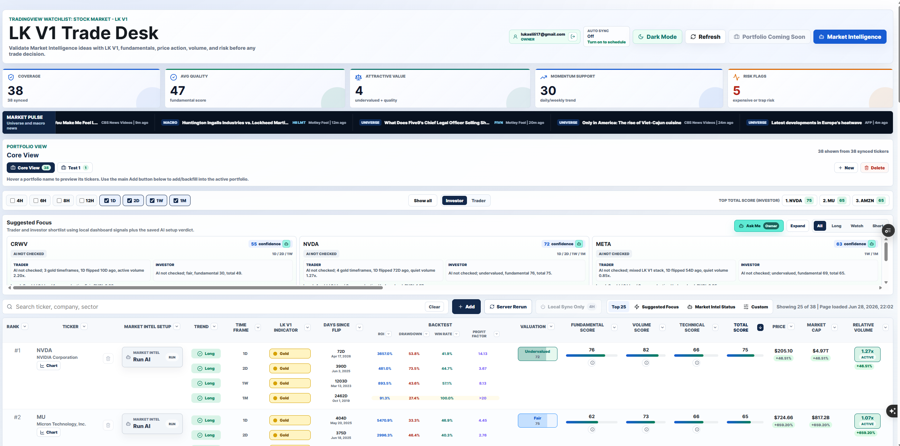
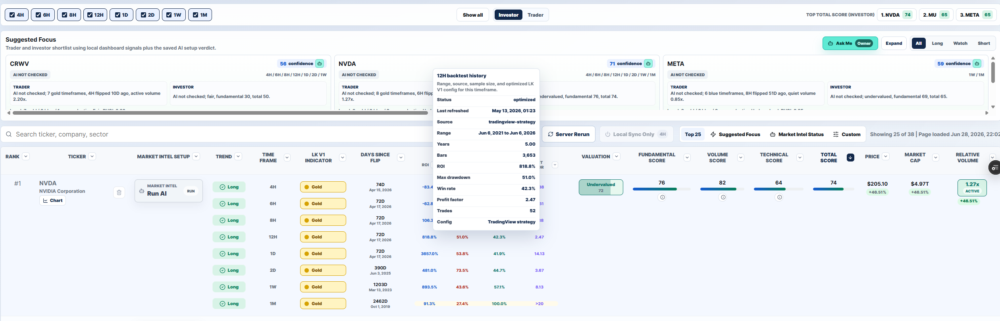
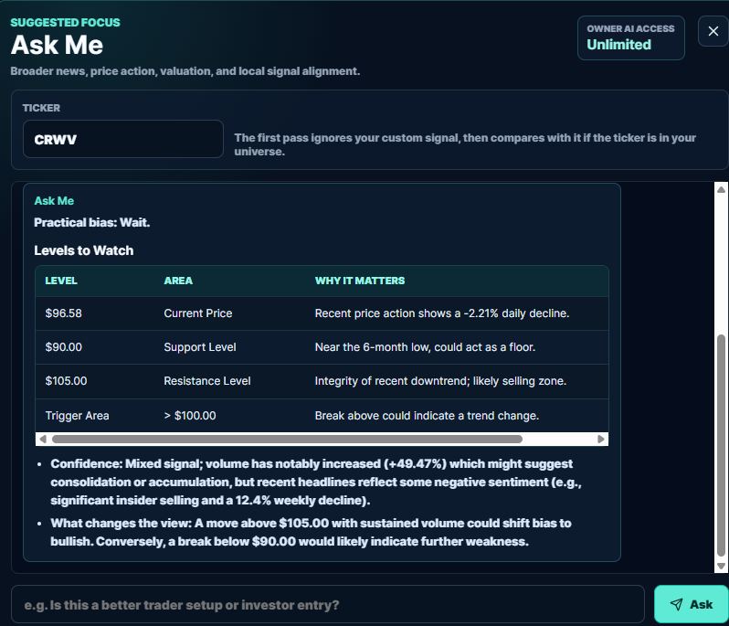
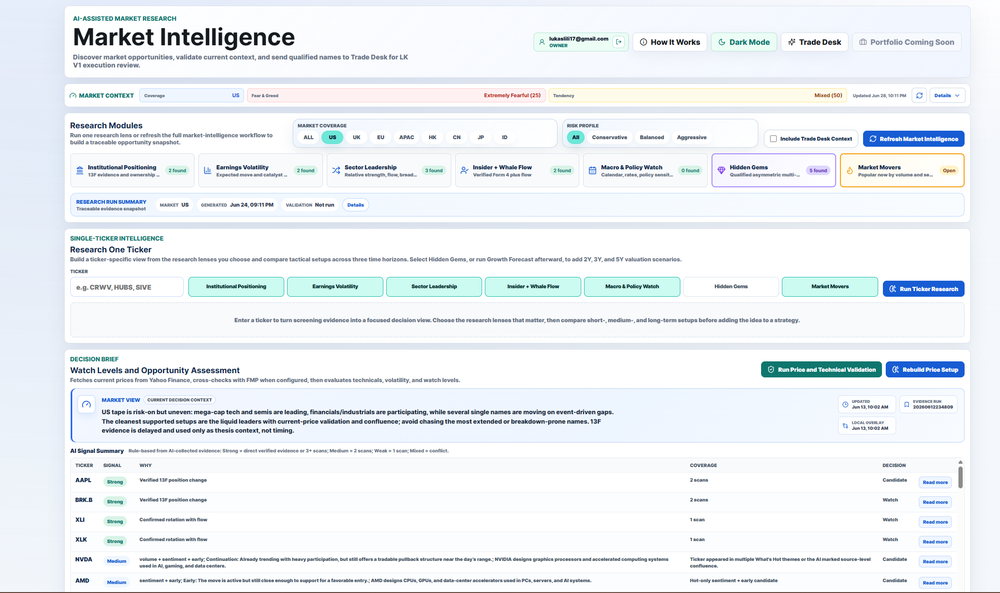
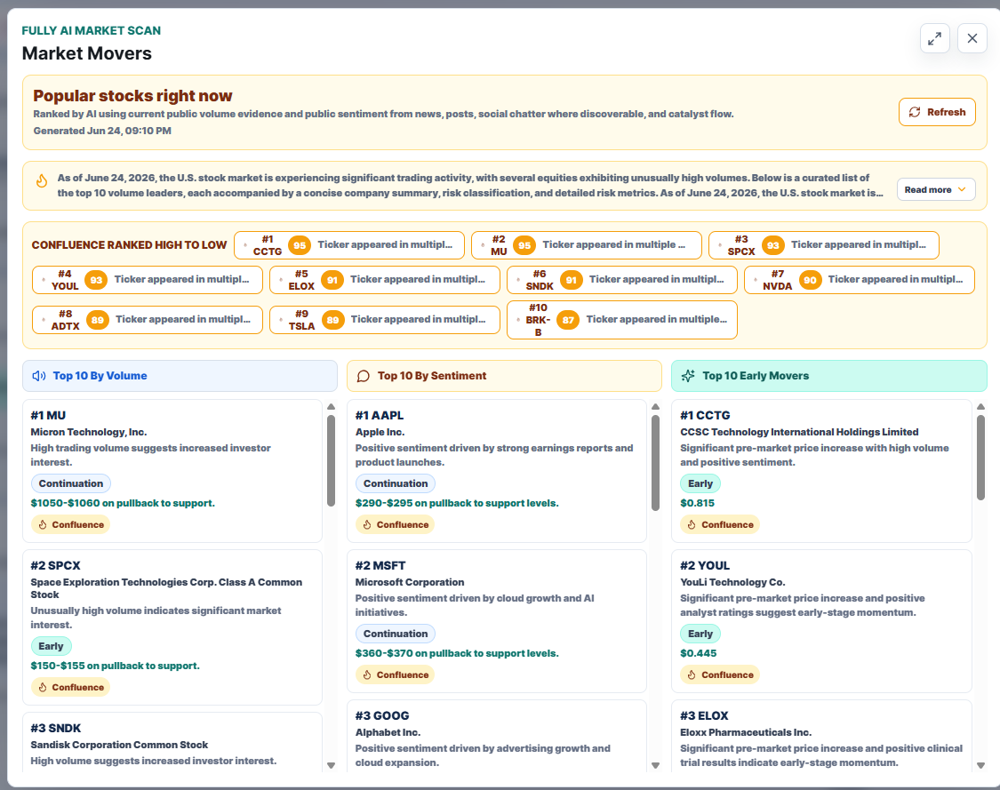

# LK V1 Trade Desk

Public showcase for **LK V1 Trade Desk**, a private trading research and paper-trading operations platform I built to turn market ideas into structured, testable, and reviewable trading decisions. The system connects signal validation, AI-assisted market research, portfolio allocation, paper execution review, and post-trade outcome tracking in one workflow.

The production implementation remains private because it contains strategy logic, execution workflows, credentials, and account-specific data. This repository is intentionally sanitized for professional review: it highlights the product design, workflow architecture, screenshots, and risk controls without exposing proprietary code or private trading data.

The private implementation, architecture decisions, and selected code examples can be discussed selectively upon request.

## Product Overview

LK V1 Trade Desk connects three trading workflows:

- **Trade Desk**: validates market ideas against local LK V1 signal states, fundamentals, volume, backtest context, AI setup status, and risk checks.
- **Market Intelligence**: discovers opportunities, runs ticker-level research, generates short/medium/long setup views, and tracks saved setup outcomes.
- **Active Portfolio**: supports paper-trading strategy allocation, target weights, allocation-drift checks, Smart Rebalance, position/order monitoring, and execution logs.

The goal is to move from scattered market observations to a disciplined research-to-review workflow: discover an idea, validate it against local signals and market context, size it in a portfolio view, and track what happened afterward.

## What This Demonstrates

- Designed a multi-module trading dashboard covering idea discovery, signal validation, setup review, and paper-portfolio monitoring.
- Built workflows for multi-timeframe signal tracking, market-data validation, factor-style scoring, and backtest context review.
- Developed AI-assisted market research that converts broad market evidence into structured setup snapshots with outcome monitoring.
- Implemented paper-trading operations concepts including target allocation, allocation drift, Smart Rebalance review, position/order monitoring, and execution logs.
- Added production-minded safeguards for stale signals, duplicate signals, invalid orders, provider failures, and manual review before execution.
- Built the application with a private Next.js/TypeScript stack, API integrations, persistence, and dashboard state management.

## Technical Areas

- Frontend product workflow design in Next.js and TypeScript.
- Market-data and signal-state normalization.
- Multi-timeframe dashboard state and scoring.
- AI-assisted research orchestration and structured setup storage.
- Paper-trading operations concepts: allocation drift, rebalance review, safeguards, and logs.
- Documentation and public/private repo separation for protecting proprietary logic.

## Implementation Access

The full implementation is maintained privately to protect strategy logic, credentials, execution workflows, and account-specific data.

Architecture decisions, workflow design, and selected implementation details can be discussed selectively upon request.

## Screenshots

### Trade Desk Overview



### Trade Desk Backtest Context



### Suggested Focus Ask Me



### Market Intelligence Overview



### Market Movers Scan



## System Flow

```text
Market data, fundamentals, watchlist inputs
        |
        v
Trade Desk local scoring and LK V1 state validation
        |
        v
Market Intelligence discovery, ticker deep dives, and setup snapshots
        |
        v
Trade Desk review of AI ideas against local signal, score, volume, and risk evidence
        |
        v
Active Portfolio allocation, Smart Rebalance, and paper execution logs
        |
        v
Outcome monitoring for saved setups, portfolio snapshots, and execution review
```

## Key Design Principles

- **Evidence-gated decisions**: AI-generated or external market ideas must be validated against local signal, score, volume, and risk evidence.
- **Paper trading first**: execution workflows are designed for paper trading and forward-testing before any live use.
- **Traceability**: setup snapshots, execution logs, and outcome monitoring make it possible to review decisions after the fact.
- **Safety over automation**: stale signals, duplicate signals, allocation breaches, invalid orders, and provider failures are treated as first-class risks.

## Public Scope

This repository includes:

- Product overview.
- Screenshots.
- Architecture notes.
- Sanitized workflow examples.
- Public explanation of design decisions and system boundaries.

This repository does **not** include:

- Private API keys or environment files.
- Full LK V1 strategy implementation.
- Proprietary Pine Script.
- Paper/live trading execution code.
- Private portfolio state.
- Private Supabase data.
- Account-specific paper-trading records.

## Documentation

- [Architecture](docs/architecture.md)
- [Workflow Examples](docs/workflows.md)
- [Public Scope And Privacy](docs/public-scope.md)

## Disclaimer

This showcase is for technical and portfolio review only. It is not financial advice, an investment recommendation, or a live trading system.
