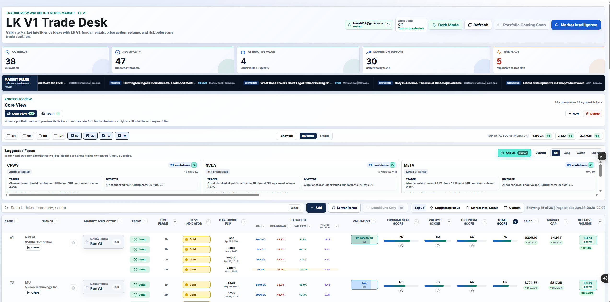
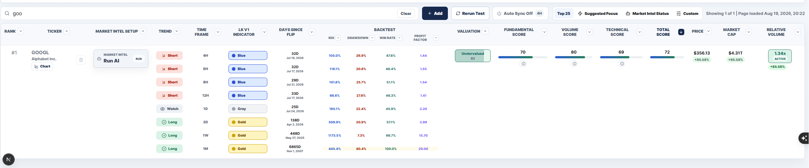
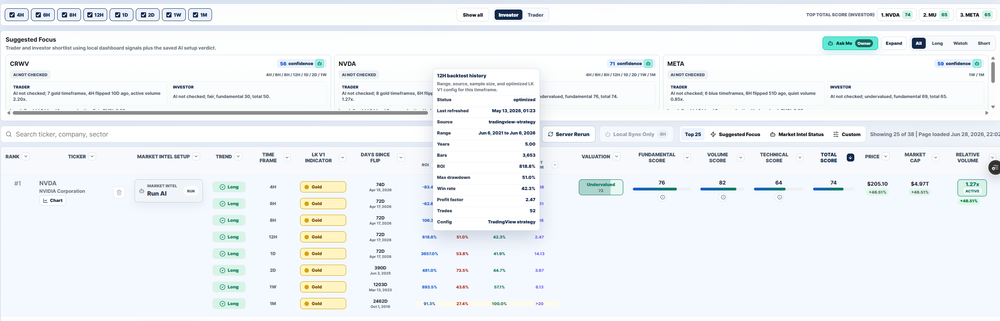
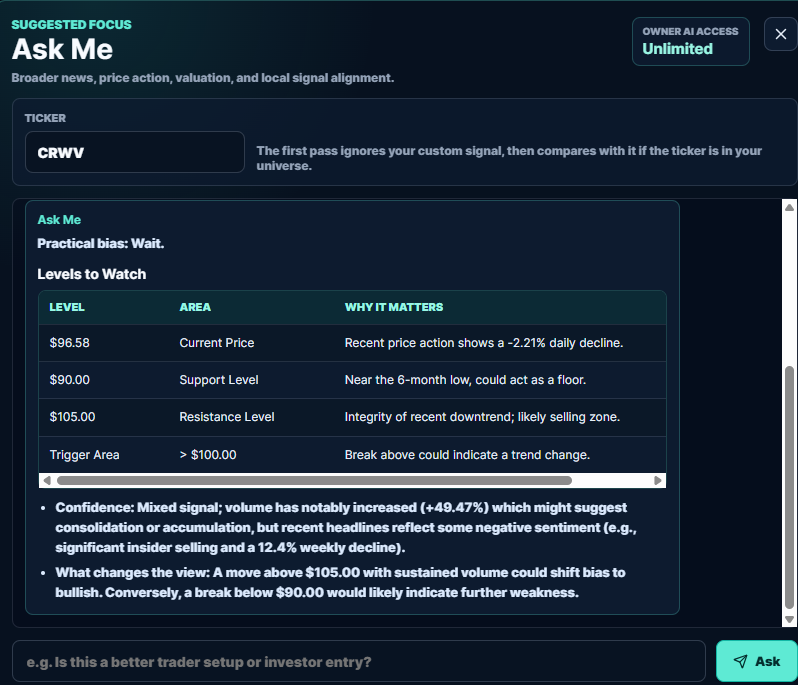
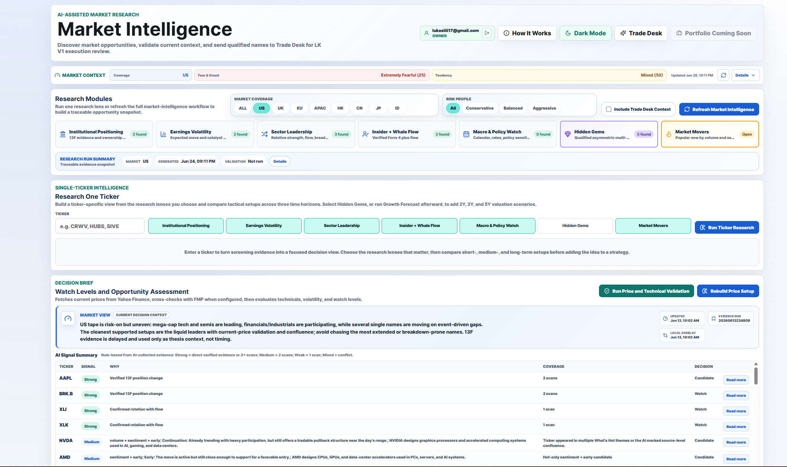
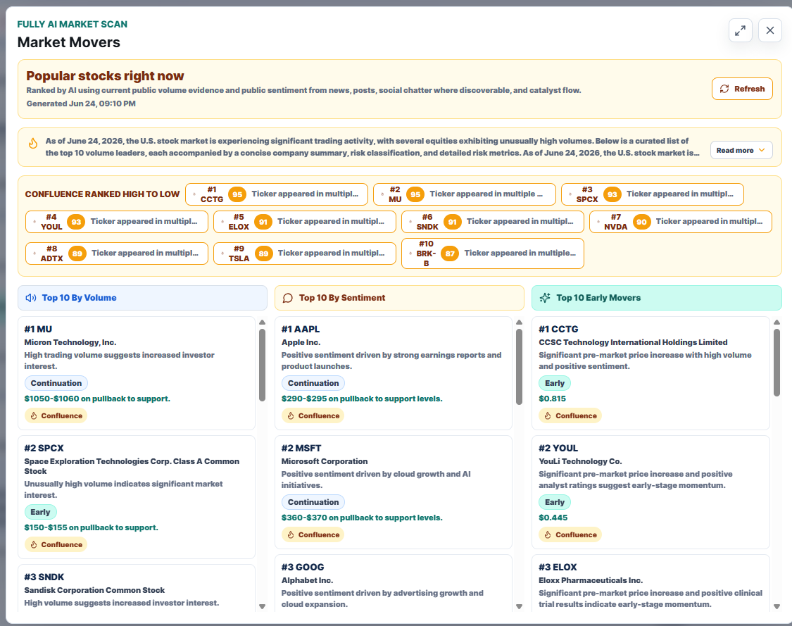
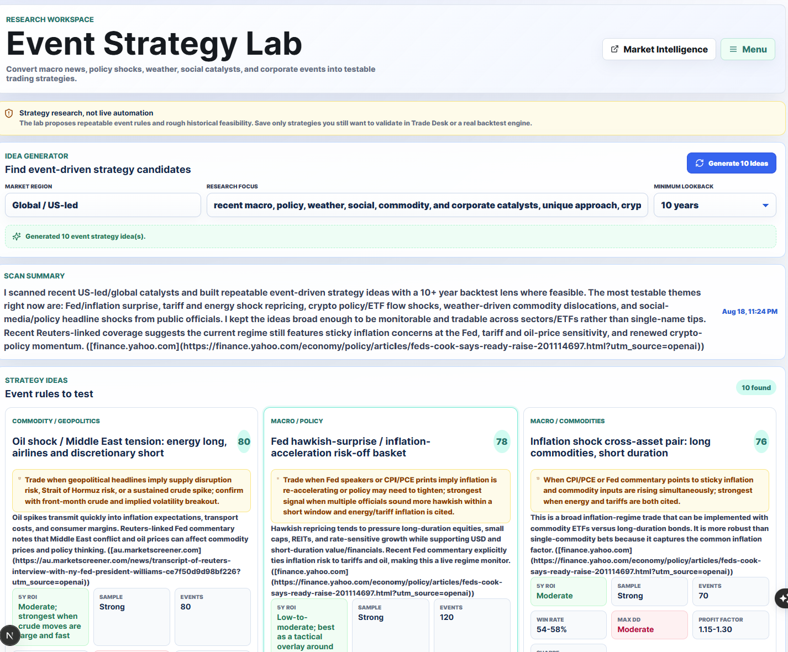
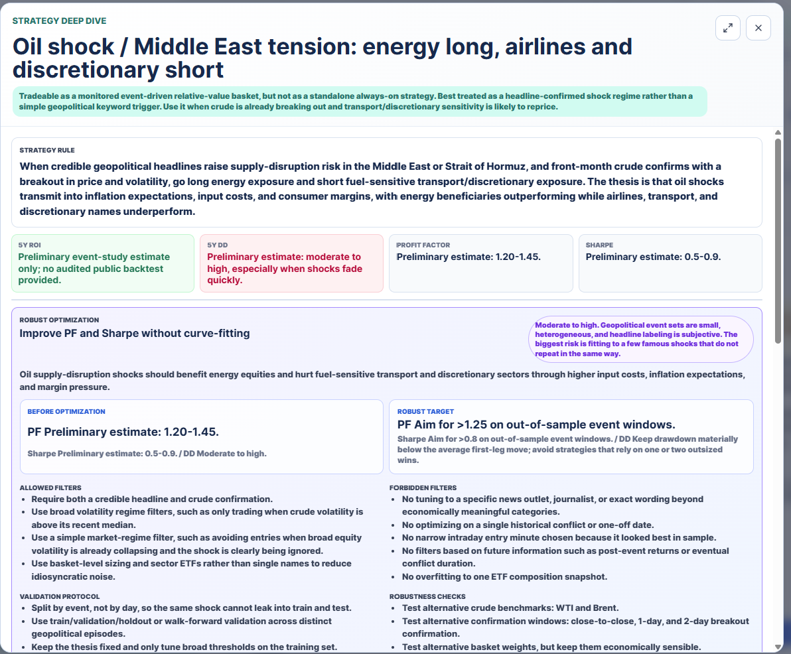
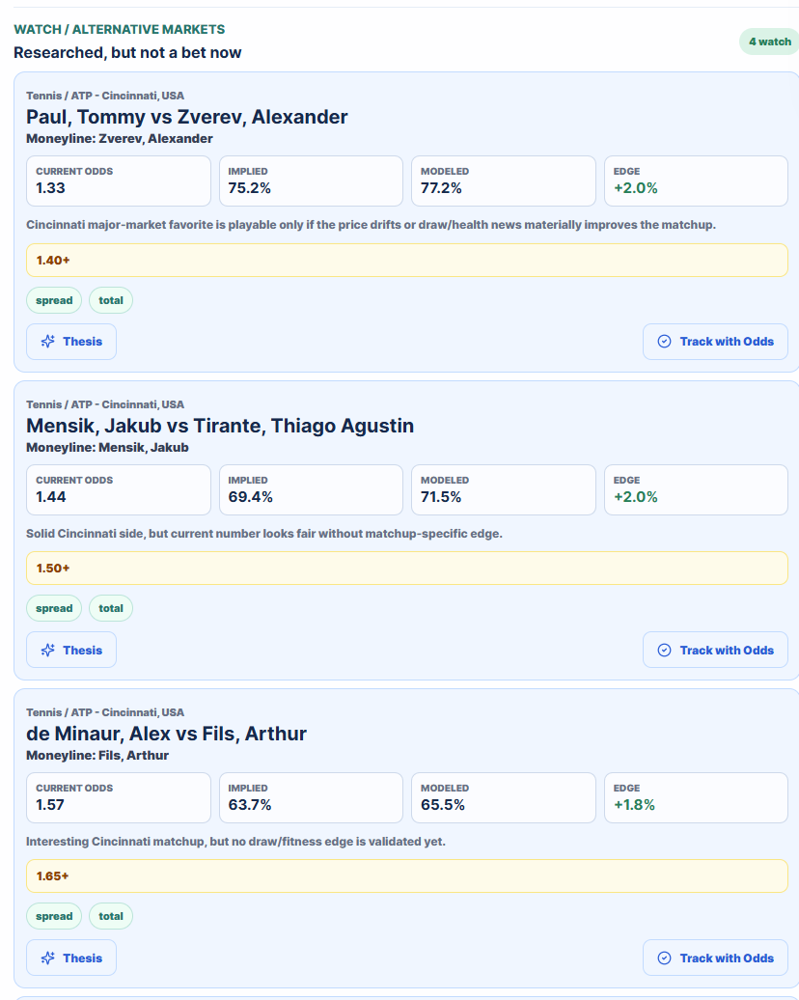

# LK Intelligence / LK V1 Trade Desk

Public showcase for **LK Intelligence**, a private trading research and paper-trading operations platform I built to turn market ideas into structured, testable, and reviewable decisions. The system connects signal validation, AI-assisted market research, event-driven strategy research, portfolio allocation, paper execution review, and post-trade outcome tracking in one workflow.

The production implementation remains private because it contains strategy logic, execution workflows, credentials, and account-specific data. This repository is intentionally sanitized for professional review: it highlights the product design, workflow architecture, screenshots, and risk controls without exposing proprietary code or private trading data.

The private implementation, architecture decisions, and selected code examples can be discussed selectively upon request.

## Why I Built This

I built LK Intelligence to make trading research more disciplined. Market ideas are easy to generate; the harder part is validating the signal, checking whether the setup is tradable, sizing it responsibly, monitoring what happened, and learning from the outcome.

The platform is designed around that full loop: idea discovery -> evidence review -> setup definition -> portfolio impact -> paper execution review -> post-trade feedback.

## Product Overview

LK Intelligence connects four core trading workflows:

- **Trade Desk**: validates market ideas against local LK V1 signal states, fundamentals, volume, backtest context, AI setup status, and risk checks.
- **Market Intelligence**: discovers opportunities, runs ticker-level research, generates short/medium/long setup views, builds decision briefs, and tracks saved setup outcomes.
- **Event Strategy Lab**: converts macro, policy, commodity, earnings, weather, and corporate catalysts into repeatable strategy rules, validation plans, and saved monitors.
- **Active Portfolio**: supports paper-trading strategy allocation, target weights, allocation-drift checks, Smart Rebalance, position/order monitoring, and execution logs.

The goal is to move from scattered market observations to a disciplined research-to-review workflow: discover an idea, validate it against local signals and market context, size it in a portfolio view, and track what happened afterward.

## What A Reviewer Can Evaluate

- Product judgment: how research, trading review, portfolio monitoring, and post-trade learning fit together.
- Trading workflow thinking: how signals move from raw market data into ranked opportunities and paper-trading review.
- Engineering judgment: how the system handles data freshness, failed providers, invalid orders, permissions, and auditability.
- Quantitative discipline: how backtests, signal scores, drawdowns, profit factor, setup outcomes, and allocation drift are shown as decision context rather than as guarantees.
- Communication: how complex trading workflows are documented clearly without exposing private strategy code.

## What This Demonstrates

- Designed a multi-module trading dashboard covering idea discovery, signal validation, event strategy research, setup review, and paper-portfolio monitoring.
- Built workflows for multi-timeframe signal tracking, market-data validation, factor-style scoring, backtest context review, and daily research triage.
- Developed AI-assisted market research that converts broad market evidence into structured setup snapshots, decision briefs, and outcome monitoring.
- Added event-driven strategy research for catalyst scanning, rule definition, historical feasibility estimates, validation protocols, and saved trigger monitors.
- Implemented paper-trading operations concepts including target allocation, allocation drift, Smart Rebalance review, position/order monitoring, and execution logs.
- Added production-minded safeguards for stale signals, duplicate signals, invalid orders, provider failures, and manual review before execution.
- Built the application with a private Next.js/TypeScript stack, API integrations, persistence, and dashboard state management.

## Technical Areas

- Frontend product workflow design in Next.js and TypeScript.
- Market-data and signal-state normalization.
- Multi-timeframe dashboard state and scoring.
- AI-assisted research orchestration, structured setup storage, and research journal workflows.
- Event-driven strategy research with trigger logic, validation plans, failure modes, and monitor definitions.
- Paper-trading operations concepts: allocation drift, rebalance review, safeguards, and logs.
- Documentation and public/private repo separation for protecting proprietary logic.

## Implementation Highlights

- Multi-timeframe signal dashboard covering 38 equities and eight configured timeframes.
- Backtest context surfaced alongside live signal state, including simulated trades, win rate, ROI, drawdown, profit factor, and configuration metadata.
- Market Intelligence workflows covering 160 tickers and 540 saved setup snapshots in the private system.
- Scheduled refresh and synchronization logic for market data, signal state, setup status, portfolio state, and review logs.
- Operational safeguards for stale signals, duplicate signals, invalid orders, provider failures, owner-gated actions, and paper-trading review.
- Screenshot-first public documentation that explains the workflow while keeping private strategy logic and account data protected.

## Implementation Access

The full implementation is maintained privately to protect strategy logic, credentials, execution workflows, and account-specific data.

Architecture decisions, workflow design, and selected implementation details can be discussed selectively upon request.

## Screenshots

### Trade Desk Overview

Universe-level dashboard for synced tickers, multi-timeframe LK V1 states, fundamentals, volume, technical scores, backtest context, Market Intelligence status, and Suggested Focus review.



### GOOGL Backtest Context

Backtest context shown beside live signal state. The purpose is to support research review while avoiding blind reliance on a single optimized result.



### Trade Desk Backtest Context

Tooltip-level view of strategy range, sample size, ROI, drawdown, win rate, profit factor, and configuration source.



### Suggested Focus Ask Me

Natural-language research layer that compares broader market context with local dashboard evidence before forming a practical view.



### Market Intelligence Overview

Research workspace for module-based opportunity discovery, ticker deep dives, decision briefs, watch levels, and setup generation.



### Market Movers Scan

AI-assisted market scan that ranks names by public evidence, volume, sentiment, catalyst flow, and tradeability context.



### Event Strategy Lab

Workspace for converting market catalysts into repeatable strategy ideas, event rules, validation plans, and saved monitors.



### Event Strategy Deep Dive

Detailed strategy view showing thesis, trigger logic, preliminary feasibility, allowed filters, forbidden filters, validation protocol, and robustness checks.



### Sports Probability Lab

Experimental probability workspace for odds, implied probability, modeled probability, edge, watch levels, and outcome review. It is included as a decision-quality lab rather than a core trading module.



## System Flow

```text
Market data, fundamentals, watchlist inputs
        |
        v
Trade Desk local scoring and LK V1 state validation
        |
        v
Market Intelligence discovery, ticker deep dives, decision briefs, and setup snapshots
        |
        v
Event Strategy Lab catalyst scans, strategy rules, and monitor definitions
        |
        v
Trade Desk review of AI ideas against local signal, score, volume, and risk evidence
        |
        v
Active Portfolio allocation, Smart Rebalance, and paper execution logs
        |
        v
Outcome monitoring for saved setups, portfolio snapshots, and execution review
```

## Key Design Principles

- **Evidence-gated decisions**: AI-generated or external market ideas must be validated against local signal, score, volume, and risk evidence.
- **Research before automation**: catalyst ideas, ticker setups, and rebalance proposals are converted into reviewable rules before they can influence execution.
- **Paper trading first**: execution workflows are designed for paper trading and forward-testing before any live use.
- **Traceability**: setup snapshots, research journals, execution logs, and outcome monitoring make it possible to review decisions after the fact.
- **Safety over automation**: stale signals, duplicate signals, allocation breaches, invalid orders, and provider failures are treated as first-class risks.

## Research Examples

- **GOOGL staged strategy sweep**: one representative GOOGL 2D long-only LK V1 configuration produced 70 simulated trades, 57.1% win rate, 2.99 profit factor, 509.9% ROI, and 20.9% maximum drawdown after 0.1% commission assumptions. This is shown as research/backtest context, not a live performance claim.
- **Event Strategy Lab**: current-catalyst scans are converted into repeatable event rules, sector/ticker baskets, entry and exit logic, failure modes, validation protocols, and saved strategy monitors.
- **Trade Tracker**: saved setups are monitored for entry activation, take-profit, stop-loss, expiry, realized return, and ambiguous outcome handling.

## Additional Research Lab

The private system also includes an experimental **Sports Probability** workspace for odds-board scanning, implied probability, edge estimation, fractional-Kelly sizing, parlay review, and outcome journaling. It is treated as a probability and decision-quality lab rather than a core trading module.

## Public Scope

This repository includes:

- Product overview.
- Screenshots.
- Architecture notes.
- Sanitized workflow examples.
- Public explanation of design decisions and system boundaries.

This repository does **not** include:

- Private API keys or environment files.
- Full LK V1 strategy implementation.
- Proprietary Pine Script.
- Paper/live trading execution code.
- Private portfolio state.
- Private Supabase data.
- Account-specific paper-trading records.
- Private strategy monitors, research journals, and event-study implementation details.

## Documentation

- [Architecture](docs/architecture.md)
- [Workflow Examples](docs/workflows.md)
- [Public Scope And Privacy](docs/public-scope.md)
- [Sanitized Signal Review Example](snippets/signal-review-example.md)
- [Sanitized Event Strategy Lab Example](snippets/event-strategy-lab-example.md)

## Disclaimer

This showcase is for technical and portfolio review only. It is not financial advice, an investment recommendation, or a live trading system.
